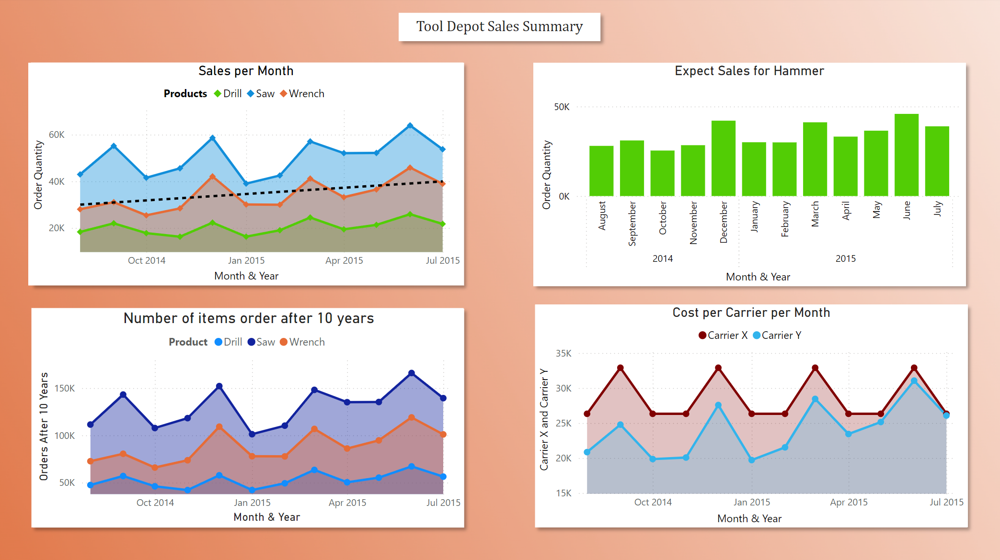
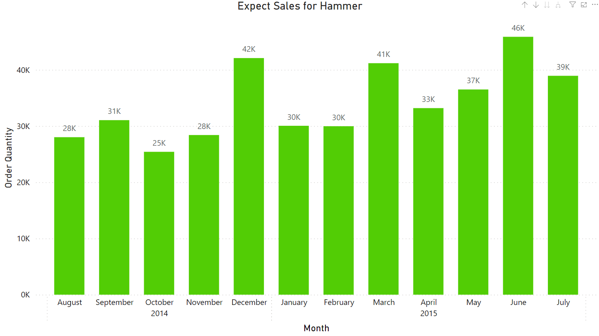
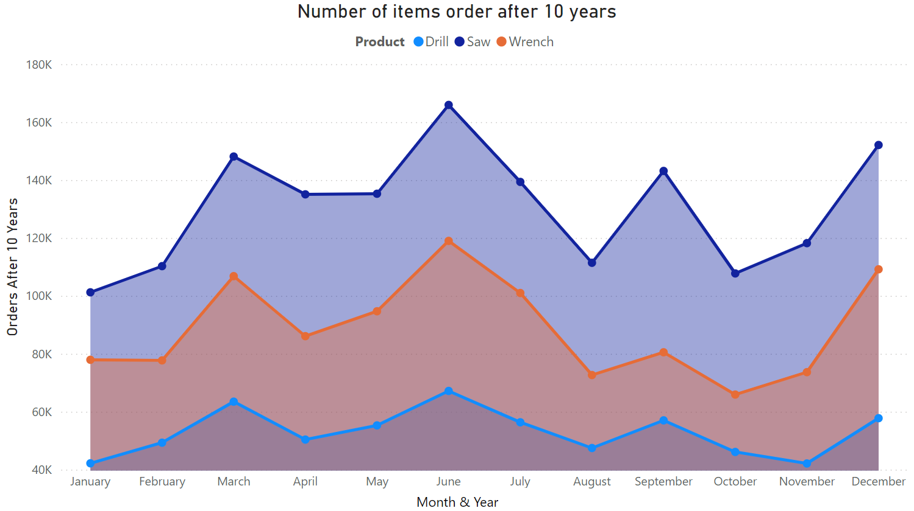

# Tool-depot

## Overview
- Tool Depot is a brick-and-mortar retailer that supplies tools for regular customers and contractors.

## What is the reason for the project
- Tool Depot is trying to pick Supplier A or Supplier B and Carrier X or Carrier Y to supply hammers to their Stores 1 and 2.
- Find the future sales if hammers were to sell at the same rate as wrenches.
- The projected sales for the next few years if they expect a 10% increase from the previous year for all their items.

## Images

## Conclusion
- Tool Depot decided to go with Supplier and Carrier Y.
- Graphed the expected sales for the next 10 years, Saw will be the items selling the most during this time.
- December and June are the best-selling months of the year.

## Technologies
- This was written and graphed using Jupyter Notebook, matplotlib, python, and Power Bi
